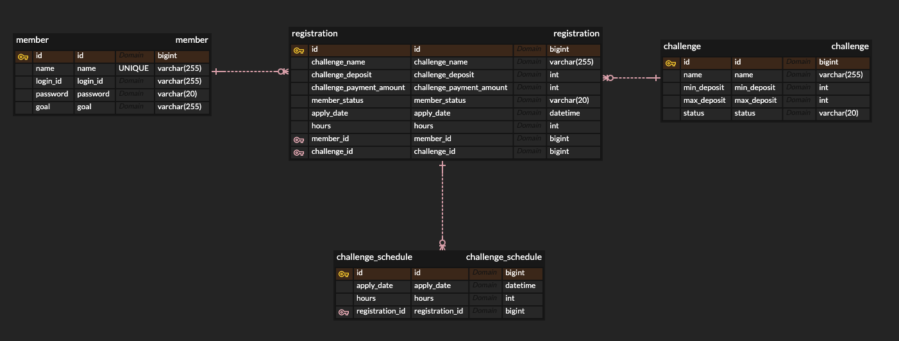

# project-studyweek
- 실행 : `java -jar studyweek.jar`
- api 명세서 : `http://localhost:8080/docs/swagger-ui/index.html#/`
- git readme 경로 : `https://github.com/helloJosh/project-studyweek`

## 1.ERD 설계

- registration(주문) 테이블의 관계를 member(회원) 테이블과 1대다, challenge(챌린지) 테이블과 1대다로 매핑하여, 주문을 취소하는 상황을 대비하여 설계하였습니다.
- registration 테이블에서 여러 개의 challenge_schedule을 가질 수 있기 때문에 1대다로 매핑하였습니다.

## 2.DB 설정
- 어느 로컬에서도 실행할 수 있게 H2 인메모리 DB를 사용했습니다.
```yaml
    dbcp2:
      initial-size: 10
      max-total: 10
      max-idle: 10
      min-idle: 10
      test-on-borrow: true
      validation-query: SELECT 1
```
- 커넥션풀은 DBCP2로 쓰레드풀과 같은 숫자인 200개가 가장 최적화가 잘되지만 로컬의 하드웨어를 고려해 초기,최대 커넥션풀은 10개 유휴 최소,최대 커넥션풀도 10개로 설정하였습니다.
- 커넥션 에러에 대한 오버헤드를 줄이기 위해 test-on-borrow, validation-query를 추가했습니다.


## 3.Entity
- 최대한 erd설계한 것과 비슷하게 만들었습니다.
- Member Entity의 loginId에 Unique 제약 조건을 걸어주었습니다. 
`@OneToMany(fetch = FetchType.LAZY, mappedBy = "member", cascade = CascadeType.ALL, orphanRemoval = true)`
- OneToMany매핑의 경우 Default값이 LAZY 임에도 명시적으로 표시하기 위해 LAZY로 설정하였습니다.
- 전파 속성은 ALL로 걸어서 모든 경우에 자식 Entity에 전파되게 매핑했습니다.
- 고아 객체는 자동적으로 삭제시키기 위해 oprhanRemoval은 true로 설정하였습니다.
```java
    public void addRegistration(Registration registration){
        this.registrations.add(registration);
        registration.setMember(this);
    }
```
- 매핑을 더 명시적으로 표현하기위해 편의 메소드를 구현했습니다.

## 4.API 명세서
- Swagger UI + RestDoc을 사용하여 비즈니스적인 코드만 적고 api 명세서를 최대한 깔끔하게 만들었습니다.

## 5. application.yml
- dev, prod로 나눠서 log 레벨을 나눌수 있게 설정하였습니다.

## 6.api package
#### Response
- 공통처리 Response 클래스를 구현했습니다.
- 공통에러처리 ErrorResponse클래스와 전역 ExceptionHandler를 구현했습니다.
#### GlobalExceptionHandler
- 모든 예외를 HTTP Error 코드에 맞춰 정리하였습니다.

## 7.auth package
#### TokenRepository
- 해쉬맵 메모리 저장소로 발급받은 리프레쉬토큰과 액세스토큰을 저장하여 발급한 토큰의 무결성을 보장해줍니다.

#### AuthenticationService
- 인증 관련 기능을 처리합니다.
- 단위 테스트로 모의객체를 만들어 테스트와 동시에 Password의 검증 같은 경우는 @Spy를 사용해 실제 데이터로 통과되는지 확인하였습니다.

#### JwtUtil
- 토큰 관련 작업을 처리하는 클래스입니다.
- 통합 테스트를 통해서 토큰 관련 작업이 잘 처리됐는지 확인했습니다.

## 8. member package
#### Controller
- 단위 테스트를 통해서 RestDoc을 생성하였습니다.
- 회원가입, 회원조회, 로그인 url 핸들링을 담당합니다.

#### Repository
- loginId로 조회하는 함수를 새로 만들었습니다.
- DataJpaTest를 통해 새로 만든 함수를 테스트했습니다.

#### Service
- 회원 가입시 Spring Security Core 안에 있는 BCryptPasswordEncoder 라이브러리를 활용해 패스워드 암호화를 했습니다.

## 9. challenge package
#### Controller
- 단위 테스트를 통해서 RestDoc을 생성하였습니다.
- 인증 토큰을 검사하며, 챌린지 주문 요청, 주문 조회 url 핸들링을 담당합니다.

#### Service
- 주문 요청, 주문 조회 서비스 코드가 구현되어있습니다.

